<!-- ══════════════════════════════════════════════════════════════════════════
     aloc999 // HASHEMI RAFSANJANI — OPERATOR DOSSIER
     GitHub strips <script> and <style>/external CSS from README markdown.
     All visual flair comes from: (a) the embedded animated SVG header,
     (b) shields.io badges, (c) markdown / emoji / <details>.
     Deploy: push this README.md + hud_header.svg to github.com/aloc999/aloc999
     ══════════════════════════════════════════════════════════════════════════ -->

<p align="center">
  
</p>

<p align="center">
  
  
  
</p>

<p align="center">
  
  
  
  
  
</p>

---

## `> whoami`

```text
● SYSTEM ONLINE
Software Research Engineer, Cybersecurity Researcher, and Bug Bounty Hunter (Intigriti, Bugcrowd)
with hands-on banking IT Security Operations — 24/7 SOC monitoring, threat hunting, and CTI.
Builds open-source offensive tooling (redgun, Xploit47, ZER0CODE, CODA) spanning web/API,
cloud, Web3, mobile, and AI/LLM security. Blends Red Team depth with Blue Team rigor.
Kendal, Central Java, ID — Indonesian · English
```

<p align="center">
  
  
  
  
</p>

---

## 🏆 IMPACT BOARD

> The hardware. SOC shifts first, bounty findings second, shipped tooling third.

<p align="center">
  <br/>
  <br/>
  <br/>
  
  
  
</p>

| Role | Org | Period | Detail |
|:----:|:----|:------:|:------:|
| 🎯 **Security Researcher** | **Intigriti** | Aug 2025 — Present | Web/API pentest on live programs, PoC + remediation |
| 🎯 **Security Researcher** | **Bugcrowd** | Aug 2025 — Present | Recon automation, auth/logic testing, triage + retest |
| 🛡️ **IT Security Operations** | **PT Bank Syariah Indonesia Tbk** | Feb 2021 — Dec 2025 | 24/7 SOC, ~50 alerts/shift, Splunk + Sentinel + Defender, CTI, pentest, OSINT/dark-web |
| 🧰 **Operational, Inventory and IT Support** | **PT Bank BNI Syariah** | Jan 2020 — Feb 2021 | Branch infra, inventory, financing docs, ticketing |
| 💻 **IT Support Assistant** | **PT Bank Negara Indonesia (Persero) Tbk** | Jan 2017 — Dec 2019 | Network/hardware/software, M365, helpdesk, firewall/cloud |

<p align="center"><sub><b>5 years</b> banking SOC · <b>2×</b> bounty platforms · <b>4×</b> security products · <b>147</b> pentest skills codified · <b>36</b> vuln classes documented</sub></p>

---

## ⚙️ ARSENAL

**Languages / Engineering Stack**

<p align="center">
  
  
  
  
  
  
  
  
  
  
  
  
</p>

**Tools & Frameworks**

<p align="center">
  
  
  
  
  
  
  
  
  
  
</p>

**Discipline spec**

- 🛡️ **SECURITY_OPS | DEFENSE** — SIEM/SOAR, Threat Hunting, DFIR, Threat Intel, MITRE ATT&CK, IDS/IPS, EDR/XDR, Network Analysis, Incident Response
- 🎯 **OFFENSIVE_SECURITY | RESEARCH** — Bug Bounty, Pentest, Red Teaming, Web/API, Burp, OWASP Top 10, AD, Cloud Red Team, Phishing Ops, OSINT/Dark Web, Mobile, AppSec/SAST
- 🤖 **AI_LLM | WEB3 | SPECIALIZED** — AI/LLM Security, Prompt Injection, AI Red Teaming, MCP/AI Agents, Web3/Smart Contracts, Audit, Attack-Path Planning, Security Tooling
- ⚙️ **QA_SDET | DETECTION | DEVSECOPS** — Playwright, Selenium, Appium, k6/Locust, Pact, Sigma, KQL/SPL, YARA/YARA-L, SOAR Playbooks, Jenkins/CI-CD, SBOM/Supply Chain

---

## 📡 RESEARCH & METHODOLOGY

**Open methodology that feeds the hunts**

- 📖 [**Bug-Hunting-Methodology**](https://github.com/aloc999/Bug-Hunting-Methodology) — 36 vuln classes, payloads, bypasses
- 🗺️ [**PENTESTING-TECHNIQUES**](https://github.com/aloc999/PENTESTING-TECHNIQUES) — web · network · AD · cloud path
- 🥷 [**ExploitNinja**](https://github.com/aloc999/ExploitNinja) — 147 pentest skills — bug bounty, web3, mobile, cloud, OSINT, AI/LLM

<details>
<summary><b>📚 Full research index</b></summary>

<br/>

| Repo | Focus | Link |
|:-----|:------|:----:|
| Bug-Hunting-Methodology | 36 vuln classes, payloads, bypass tables, severity + impact validation | [repo](https://github.com/aloc999/Bug-Hunting-Methodology) |
| PENTESTING-TECHNIQUES | Web · network · AD · cloud attack paths, recon to exploit validation | [repo](https://github.com/aloc999/PENTESTING-TECHNIQUES) |
| ExploitNinja | 147 skills monorepo — bounty, web3, mobile, cloud, OSINT, AI/LLM | [repo](https://github.com/aloc999/ExploitNinja) |

<sub>Methodology directly feeds live Intigriti + Bugcrowd hunting — recon automation, manual validation, reproducible PoCs within SLA.</sub>

</details>

---

## 📦 BLUE TEAM — DETECTION ENGINEERING

**Detection-as-code across Splunk / Sentinel / Chronicle** &nbsp; → &nbsp; [`DetectionEngineeringPortfolio`](https://github.com/aloc999/DetectionEngineeringPortfolio)

<p align="center">
  
  
  
  
  
  
  
</p>

- 🧠 Sigma, KQL, SPL, YARA-L/YARA mapped to MITRE ATT&CK (endpoint, cloud, container, identity, network)
- 🔁 LLM CTI → hunt pipeline, SOAR phishing-response playbooks, pytest + CI validation
- 🏦 Proven in banking 24/7 SOC: ~50 alerts/shift triage, false-positive tuning, VirusTotal/AbuseIPDB/MISP enrichment, header forensics + IOC blocking

---

## ✍️ OFFENSIVE TOOLING

- 🛠️ [**redgun**](https://github.com/aloc999/redgun) — CLI web auditor — black/white-box, ~120 modules, AI attack chains
- 🧠 [**Xploit47**](https://github.com/aloc999/Xploit47) — AI-powered pentest reasoning MCP — Beam Search + MCTS attack-path planning
- ⚡ [**ZER0CODE**](https://github.com/aloc999/ZER0CODE) — AI red-team coding agent for offensive workflows
- 🔗 [**CODA**](https://github.com/aloc999/CODA) — smart-contract audit arsenal — 26 tools, static analysis to formal verification
- 🐎 [**CavalryHive**](https://github.com/aloc999/CavalryHive) — autonomous web-assessment toolkit — self-learning profiles, adaptive payload mutation, zero-FP design

<p align="center">
  
  
  
  
  
</p>

---

## 🤖 SECURITY TOOLING — DEEP DIVE

> I don't only hunt — I build the machinery too.

**🎯 redgun** &nbsp; 

CLI web auditor — black/white-box, ~120 modules, AI attack chains across web/API. Built for authorized bounty + pentest loops: recon → vuln ID → exploit validation with PoC evidence.

<p align="center">
  
  
  
  <br/>
  <a href="https://github.com/aloc999/redgun"></a>
</p>

**🧠 Xploit47** &nbsp; 

AI-powered pentest reasoning MCP — deterministic attack-path planning with explainable scoring, kill-chain phase, tool recommendation, and next-step hints.

<p align="center">
  <a href="https://github.com/aloc999/Xploit47"></a>
</p>

**⚡ ZER0CODE + 🔗 CODA + 🐎 CavalryHive**

- [ZER0CODE](https://github.com/aloc999/ZER0CODE) — AI red-team coding agent for offensive workflows (authorized only)
- [CODA](https://github.com/aloc999/CODA) — 26-tool smart-contract audit arsenal — static analysis → formal verification
- [CavalryHive](https://github.com/aloc999/CavalryHive) — autonomous assessment — adaptive mutation chains, differential-verified findings

<p align="center">
  <a href="https://github.com/aloc999/ZER0CODE"></a>
  <a href="https://github.com/aloc999/CODA"></a>
  <a href="https://github.com/aloc999/CavalryHive"></a>
</p>

---

## 🌐 SHIPPED / BUILDS

> I don't only break things — I ship production SaaS too.

**🎫 [ticketmind](https://github.com/aloc999/ticketmind) · 🔗 [snaplink](https://github.com/aloc999/snaplink) · 🧾 [invoicely](https://github.com/aloc999/invoicely)**

Production Next.js 15 + Prisma + PostgreSQL SaaS trio: TicketMind (AI support desk — RBAC, auto-classification, draft replies, analytics), Snaplink (URL shortener — REST API, click dashboards), Invoicely (multi-tenant invoicing — org-scoped data, plan limits, printable docs).

**🧪 QARonin** &nbsp;→&nbsp; [`QARonin`](https://github.com/aloc999/QARonin)

SDET monorepo — RoninShop SUT exercised by Playwright-TS/C#, Cypress, Selenium 4, Appium 2, Karate, Behave, pytest API + Postman/Newman; Pact contracts, agentic self-healing locators, k6/Locust/JMeter SLOs, sub-30-min 4-shard gate (GHA + GitLab CI mirror). Companion automation: [`orangehrm-ui-automation-playwright`](https://github.com/aloc999/orangehrm-ui-automation-playwright), [`stripe-testmode-api-automation`](https://github.com/aloc999/stripe-testmode-api-automation), [`vatcomply-api-automation-pytest`](https://github.com/aloc999/vatcomply-api-automation-pytest).

**🔒 DevSecOpsPortfolio** &nbsp;→&nbsp; [`DevSecOpsPortfolio`](https://github.com/aloc999/DevSecOpsPortfolio)

Zero-trust platform: Jenkins CI/CD, SonarQube gates, JFrog Xray + Snyk SCA, Docker SBOM/Cosign, Terraform + Ansible IaC, SAST/DAST/secrets/IaC with CIS/NIST/PCI mapping.

**🔧 Systems / Embedded depth** — [`framepipe`](https://github.com/aloc999/framepipe) · [`streamforge`](https://github.com/aloc999/streamforge) · [`picam-edge`](https://github.com/aloc999/picam-edge) · [`v4l2-virtual-cam`](https://github.com/aloc999/v4l2-virtual-cam) · [`poescope`](https://github.com/aloc999/poescope) · [`visionflow`](https://github.com/aloc999/visionflow)

C/C++/Python video + network engineering: zero-copy pipelines, GStreamer RTSP, V4L2 drivers, LLDP/CDP + SNMP PoE, YOLO/PyTorch vision. Proves low-level depth behind the security tooling.

**🖥️ Live CV** — this dossier lives on the web too → **[aloc999.github.io](https://aloc999.github.io/)** ([`aloc999.github.io`](https://github.com/aloc999/aloc999.github.io))

<p align="center">
  
  
  
  
  
</p>

---

## 🎓 CERTIFICATIONS

<details open>
<summary><b>[ RED_TEAM · OFFENSIVE_SECURITY ]</b></summary>

- Certified Red Team Specialist (CRTS) — CyberWarfare Labs — Apr 2026
- Certified Offensive Phishing Operator — CyberWarfare Labs — Apr 2026
- Multi-Cloud Red Team Analyst — CyberWarfare Labs — Mar 2026
- Web Red Team Analyst — CyberWarfare Labs — Mar 2026
- Cybernetics Pro Labs — Hack The Box — Jan 2026
- Certified Red Team Analyst (CRTA) — CyberWarfare Labs — Dec 2025
- Certified API Red Team Analyst — CyberWarfare Labs — Dec 2025
- Certified Associate Penetration Tester — Hackviser — Dec 2025
- Certified Red Team Operations Management — Red Team Leaders — Dec 2025

</details>

<details>
<summary><b>[ BLUE_TEAM · CTI · DFIR · OSINT ]</b></summary>

- CSI Linux Certified Investigator Academy — CSI Linux — Jan 2026
- Certified Threat Intelligence & Governance Analyst — Red Team Leaders — Jan 2026
- Chinese OSINT (Certificate of Competence) — Hacktoria — Jan 2026
- DFIR Foundations & Techniques — Blue Cape Security — Jan 2026
- Hands-On KQL for Security Analysis — Blu Raven Academy — Jan 2026
- ICS CyberSecurity Vulnerabilities (21OW-07) — U.S. DHS — Jan 2026
- Operation Gambler OSINT CTF — UK OSINT Community — Jan 2026
- Cyber Threat Intelligence Analyst — arcX — Dec 2025
- Blue Team Junior Analyst — Security Blue Team — Dec 2025
- Advanced OSINT Mastery — Red Team Leaders — Mar 2026
- Maltego for Cybercrime — Maltego — 2026

</details>

<details>
<summary><b>[ GOVERNANCE · AI · PRIVACY · FOUNDATIONS ]</b></summary>

- ISO/IEC 42001:2023 Lead Auditor (AIMS) — Jul 2026
- ISO/IEC 27701:2025 Lead Auditor (PIMS) — Jul 2026
- ISO/IEC 27001:2022 Lead Auditor — MasterMind Assurance — Dec 2025
- CSCSO / CRPO — ICTTF — Dec 2025
- Google Cybersecurity Professional — Google — Dec 2025
- APU PPT AML/CFT — LPPI Indonesia — Oct 2022
- Lean Six Sigma White Belt — Dec 2025

</details>

---

## 💼 EXPERIENCE — DETAIL

**Security Researcher — Intigriti** `Aug 2025 — Present`
- Web app + API pentest on live programs — recon, vuln ID, PoC validation
- Severity + business-impact validation, remediation guidance, responsible disclosure within SLA

**Security Researcher — Bugcrowd** `Aug 2025 — Present`
- Continuous vuln research — attack-surface mapping, recon automation, false-positive filtering
- Auth flows, app logic, endpoint exposure — confirmed findings + impact; triage + retest, scope tracking

**IT Security Operations — PT Bank Syariah Indonesia Tbk** `Feb 2021 — Dec 2025`
- Triaged ~50 alerts/shift in 24/7 SOC; tuned FPs, escalated with severity classification
- Daily handover + weekly CTI summaries mapped to MITRE ATT&CK; Splunk + Sentinel + Defender EDR; VT/AbuseIPDB/MISP enrichment
- Pentest for hardening; malware + phishing end-to-end (header forensics, detonation, IOC blocking, credential reset)
- Cloud security, IDS/IPS, firewall; OSINT + dark-web monitoring under OpSec; emerging-vector research

**Operational, Inventory and IT Support — PT Bank BNI Syariah** `Jan 2020 — Feb 2021`
- Financing contracts, inventory/warehouse systems, branch servers/routing/intranet, notary + regulator reporting, ticketing

**IT Support Assistant — PT Bank Negara Indonesia (Persero) Tbk** `Jan 2017 — Dec 2019`
- Network/hardware/software install + troubleshooting, M365, helpdesk lifecycle, traffic analysis, patching

**Education:** Bachelor — Economics and Business, Accounting Information Systems — Universitas Dian Nuswantoro `Aug 2012 — Aug 2016`

**Hobbies:** Reading · Coding · Basketball · Football · Coffee · Music

---

## 📊 STATS

<p align="center">
  
  
</p>

<p align="center">
  
</p>

<p align="center">
  
</p>

---

## 📮 CONTACT

<p align="center">
  <a href="https://github.com/aloc999"></a>
  <a href="https://gitlab.com/aloc999"></a>
  <a href="https://linkedin.com/in/hashemirafsanjani"></a>
  <a href="mailto:hashemi.official@gmail.com"></a>
</p>

<p align="center"><sub>Open to <strong>bug bounty collaboration</strong>, <strong>threat intel / SOC</strong> work and <strong>security tooling</strong> collabs — reach me on <a href="https://github.com/aloc999">GitHub</a> or by email. Kendal, Central Java, ID.</sub></p>

---

<p align="center">
  
</p>

<p align="center"><sub>— <i>aloc999</i> · <code>● SYSTEM ONLINE</code></sub></p>
